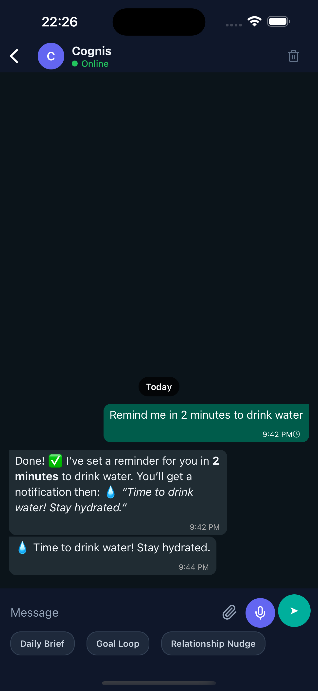
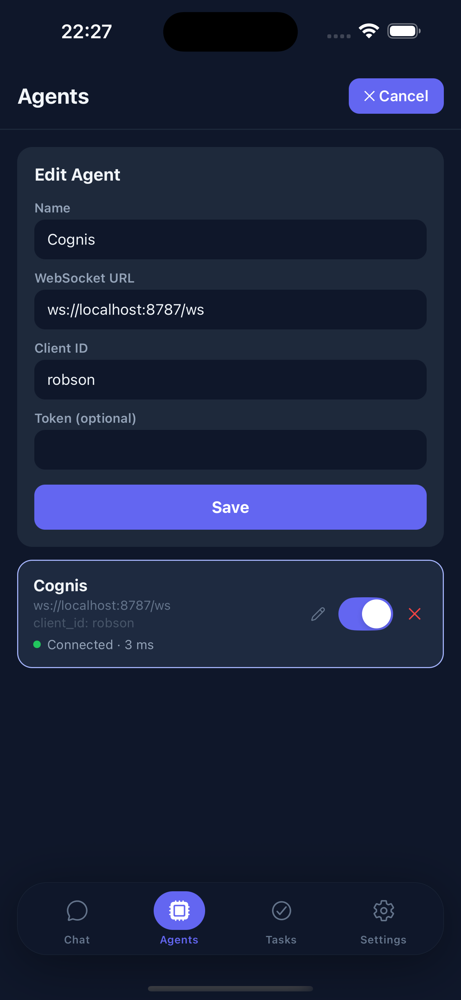
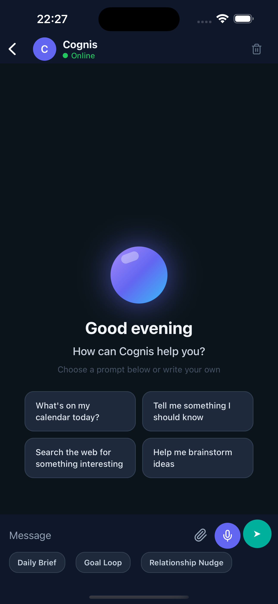
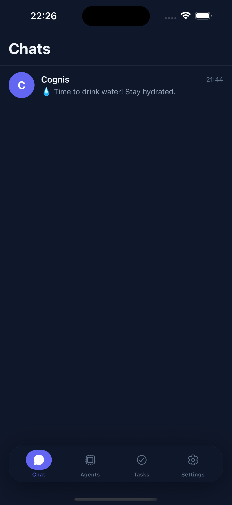
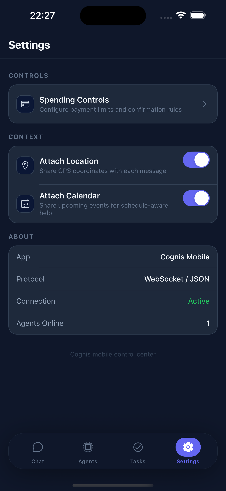
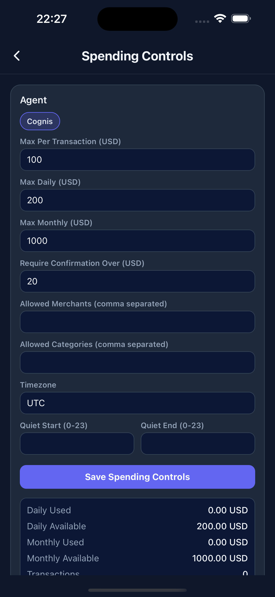
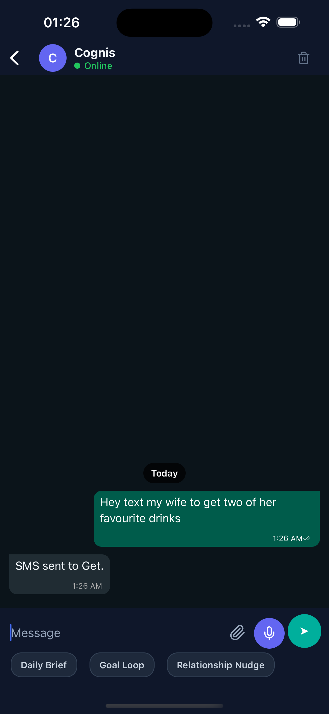
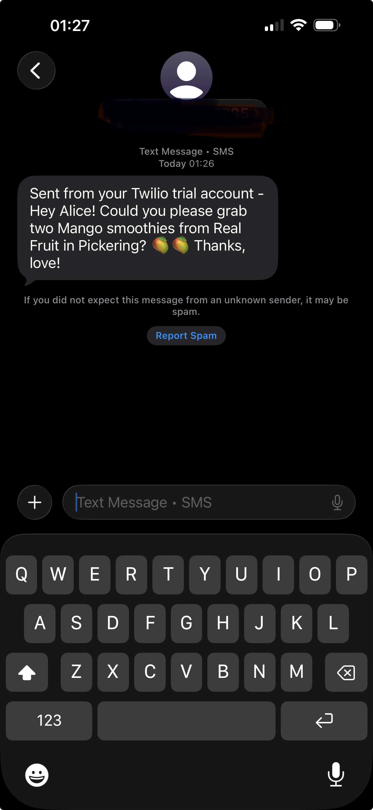

# Cognis

Cognis is a Java 21 autonomous agent runtime focused on practical execution: tool use, scheduling, memory, payment guardrails, and auditable operations for mobile-first workflows.

Cognis started from ideas inspired by NanoClaw/OpenClaw, then evolved into a Java-first MCP + mobile architecture.

## Why Cognis

Cognis is positioned as a trusted autonomous operator:

- Guardrailed actions (payments policy + confirmation thresholds)
- Accountable execution (audit trail + dashboard metrics)
- Mobile-native interaction (WebSocket protocol with typing/streaming/ack)
- Local-first deployment (Docker, file-backed state, no managed cloud dependency required)

## Architecture

```text
clawmobile (mobile)
        |
        | WebSocket + HTTP
        v
+-----------------------------+
| cognis-app (composition)    |
|  - GatewayServer (Undertow) |
|  - CLI commands             |
+--------------+--------------+
               |
               v
+-----------------------------+
| cognis-core                 |
|  - AgentOrchestrator        |
|  - ProviderRouter           |
|  - ToolRegistry             |
|  - Workflow/Cron/Memory     |
|  - Payments + Observability |
+-----------------------------+
               |
               v
       File-backed stores
  (.cognis/*, memory/*, uploads/*)
```

## Modules

- `cognis-core`: domain logic, providers, tools, workflow, payments, observability, gateway primitives
- `cognis-cli`: command-line shell around core runtime
- `cognis-app`: executable app and wiring (providers, tools, gateway, stores)
- `cognis-dashboard`: React/Vite operations dashboard for metrics + audit trail

## Documentation

- Migration plan: `docs/MIGRATION_PLAN.md`
- Operations runbook: `docs/OPERATIONS.md`
- MCP server bootstrap guide: `docs/MCP_SERVER.md`
- Contributing guide: `CONTRIBUTING.md`
- Mobile test client (React Native): `https://github.com/rmukubvu/clawmobile`

## Core Features

- Java 21 runtime (virtual threads used in gateway execution path)
- Multi-provider routing + fallback chains
  - `openrouter`, `openai`, `anthropic`, `bedrock`, `bedrock_openai`, `openai_codex`, `github_copilot`
- Tooling
  - `filesystem`, `shell`, `web`, `cron`, `message`, `memory`, `profile`, `notify`, `payments`, `workflow`, `vision` (when configured)
- Mobile gateway
  - HTTP upload/transcribe/files + WebSocket chat protocol
- Memory and context
  - SQLite-backed conversation history (default), session summary, profile, long-term memory
- Payments guardrails
  - policy limits, merchant/category allowlists, confirmation threshold, quiet hours, status and ledger tracking
- Observability
  - append-only audit events + derived dashboard metrics
- Dashboard
  - KPI cards, execution snapshot, audit filtering, CSV export

## Repository Layout

```text
.
├── cognis-app/
├── cognis-cli/
├── cognis-core/
├── cognis-dashboard/
├── docker/
├── docker-compose.yml
├── Dockerfile
└── .env.example
```

## Requirements

- Java 21
- Maven 3.9+
- Docker + Docker Compose (optional, recommended for quick start)
- Node 20+ (for `cognis-dashboard`)

## Quick Start (Docker)

1. Create environment file:

```bash
cd /path/to/cognis
cp .env.example .env
```

If `.env.example` does not show in Finder, enable hidden files with `Cmd+Shift+.` or run `ls -la`.

2. Set at least one provider credential in `.env`:

```bash
OPENROUTER_API_KEY=...
# or OPENAI_API_KEY=...
# or ANTHROPIC_API_KEY=...
# or Bedrock via IAM credentials/role:
# AWS_REGION=us-east-1
# AWS_ACCESS_KEY_ID=...
# AWS_SECRET_ACCESS_KEY=...
# AWS_SESSION_TOKEN=...   # only for temporary credentials
# AWS_PROFILE=...         # optional local profile alternative
# or Bedrock OpenAI-compatible endpoint (bearer token):
# COGNIS_PROVIDER=bedrock_openai
# AWS_BEARER_TOKEN=...
# BEDROCK_OPENAI_API_BASE=https://bedrock-runtime.us-east-1.amazonaws.com/openai/v1
```

3. Start Cognis gateway + MCP server + dashboard:

```bash
docker compose up --build
```

Gateway default URL:

- HTTP: `http://127.0.0.1:8787`
- WebSocket: `ws://127.0.0.1:8787/ws?client_id=<your-client-id>`
- MCP tools endpoint: `http://127.0.0.1:8791/mcp/tools`
- Operations dashboard: `http://127.0.0.1:4173`

Persistent data:

- `./docker-data` -> `/home/cognis/.cognis` inside container

### Useful Docker commands

```bash
# Run gateway in background
docker compose up -d --build

# Tail logs
docker compose logs -f cognis cognis-mcp-server cognis-dashboard

# Tail only SMS/MCP flow
docker compose logs -f cognis-mcp-server | rg "twilio|/mcp/call|ERROR|WARN"

# Tail tool + task execution path
docker compose logs -f cognis | rg "task_|tool_|ERROR|WARN"

# Stop
docker compose down

# Run one-off CLI prompt in container
docker compose run --rm cognis agent "hello from docker"
```

Dashboard audit quick filter:

1. Open `http://127.0.0.1:4173`.
2. In Audit Trail, set `Scope` to `Tool events only`.
3. Optionally set `Type` to `tool_succeeded` and search `twilio.send_sms`.

## In Action: Cognis + ClawMobile

End-to-end flow using the ClawMobile app connected to a local Cognis gateway.

1. Open chat list and verify Cognis appears.
2. Edit/connect the Cognis agent (`ws://localhost:8787/ws` + client id).
3. Open a Cognis conversation with starter prompts.
4. Ask for a reminder and receive both ack + follow-up notification.
5. Review the cleaner settings menu layout.
6. Open Spending Controls from Settings and adjust limits.

| | | |
|---|---|---|
|  |  |  |
|  |  |  |

## Quick Start (Local Maven)

```bash
cd /path/to/cognis
mvn test
mvn -pl cognis-app -am package
java -jar cognis-app/target/cognis-app-0.1.0-SNAPSHOT.jar gateway --port 8787
```

CLI examples:

```bash
java -jar cognis-app/target/cognis-app-0.1.0-SNAPSHOT.jar onboard
java -jar cognis-app/target/cognis-app-0.1.0-SNAPSHOT.jar status
java -jar cognis-app/target/cognis-app-0.1.0-SNAPSHOT.jar agent "Plan my day"
```

## MCP Integration Server (Bootstrap)

Cognis now includes a separate Java MCP-style integration server module for external commerce/ride/communications providers.

```bash
mvn -pl cognis-mcp-server -am package
java -jar cognis-mcp-server/target/cognis-mcp-server-0.1.0-SNAPSHOT.jar
```

Default URL: `http://127.0.0.1:8791`

Endpoints:

- `GET /healthz`
- `GET /mcp/tools`
- `POST /mcp/call`

Docker Compose starts this server automatically as `cognis-mcp-server` and wires Cognis to it.

In Cognis agent runtime, the generic `mcp` tool uses `COGNIS_MCP_BASE_URL` to discover and call MCP tools dynamically.

Recommended skill-driven pattern:

1. Use `mcp` action `list_tools` to discover capabilities.
2. Use `profile` / `memory` to persist aliases (for example `contacts.wife.sms=+1...`).
3. Use `mcp` action `call_tool` with resolved values (for example `twilio.send_sms`).

### MCP SMS In Action

| | |
|---|---|
|  |  |

See `docs/MCP_SERVER.md` for architecture and provider env vars.

## Trying Cognis Without WhatsApp

WhatsApp integration is not required to run or test Cognis.

Primary path:

- Use the React Native app (`https://github.com/rmukubvu/clawmobile`) as the client over WebSocket to `ws://127.0.0.1:8787/ws?client_id=<id>`.

Quick local validation paths:

- 5-minute smoke test script:
  - `./scripts/smoke-test.sh`
- CLI path:
  - `java -jar cognis-app/target/cognis-app-0.1.0-SNAPSHOT.jar agent "hello"`
- Raw WebSocket path (no mobile app required):
  - `websocat ws://127.0.0.1:8787/ws?client_id=smoke-test`
  - send: `{"type":"message","content":"hello","msg_id":"m1"}`
- Persistence check for default SQLite conversation store:
  - `sqlite3 ~/.cognis/workspace/.cognis/conversations.db "select created_at,prompt from conversation_turns order by created_at desc limit 5;"`

Smoke test options:

- `COGNIS_SMOKE_RUN_CORE_TESTS=0 ./scripts/smoke-test.sh` to skip targeted core tests.
- `COGNIS_SMOKE_BUILD_APP=0 ./scripts/smoke-test.sh` to skip app compile checks.

## Configuration

Docker entrypoint writes `/home/cognis/.cognis/config.json` from env (unless `COGNIS_WRITE_CONFIG=false`).

Important environment variables:

- `OPENROUTER_API_KEY`
- `OPENAI_API_KEY`
- `ANTHROPIC_API_KEY`
- `AWS_REGION` (or `AWS_DEFAULT_REGION`) for Bedrock
- Optional static Bedrock credentials: `AWS_ACCESS_KEY_ID`, `AWS_SECRET_ACCESS_KEY`, `AWS_SESSION_TOKEN`
- Optional local profile for Bedrock: `AWS_PROFILE`
- `AWS_BEARER_TOKEN` for `bedrock_openai`
- Optional `BEDROCK_OPENAI_API_BASE` (default is region-derived Bedrock `/openai/v1` endpoint)
- `COGNIS_PROVIDER` (default: `openrouter`)
- `COGNIS_MODEL` (default: `anthropic/claude-opus-4-5`)
- `WEB_SEARCH_API_KEY` (used by `web` tool search action)
- `COGNIS_GATEWAY_PORT` (default: `8787`)
- `COGNIS_CONVERSATION_STORE` (`sqlite` or `file`, default: `sqlite`)
- `COGNIS_CONVERSATION_SQLITE_PATH` (optional custom SQLite path when store is `sqlite`; default: `<workspace>/.cognis/conversations.db`)
- `COGNIS_WRITE_CONFIG` (default: `true`)

See `.env.example`.

Optional helper:

- Open `docs/env-setup.html` in a browser to generate a ready-to-paste `.env` with provider presets.

## API Reference

### Health

- `GET /healthz`

Example:

```bash
curl http://127.0.0.1:8787/healthz
```

### File and Voice

- `POST /upload` -> stores file in uploads
- `POST /transcribe` -> transcribes provided audio file
- `GET /files/{filename}` -> reads stored upload

### Payments

- `GET /payments/policy`
- `PUT /payments/policy` (also accepts `POST`)
- `GET /payments/status`

Set policy example:

```bash
curl -X PUT http://127.0.0.1:8787/payments/policy \
  -H 'Content-Type: application/json' \
  -d '{
    "currency": "USD",
    "max_per_tx": 50,
    "max_daily": 120,
    "max_monthly": 500,
    "require_confirmation_over": 20,
    "allowed_merchants": ["amazon", "ticketmaster"],
    "allowed_categories": ["shopping", "tickets"],
    "timezone": "UTC"
  }'
```

### Observability

- `GET /dashboard/summary`
- `GET /audit/events?limit=100`

Example:

```bash
curl http://127.0.0.1:8787/dashboard/summary
curl 'http://127.0.0.1:8787/audit/events?limit=50'
```

## WebSocket Protocol (`/ws`)

Connect:

```text
ws://127.0.0.1:8787/ws?client_id=<client-id>[&token=<token>]
```

Inbound (client -> server):

- `{"type":"ping"}`
- `{"type":"message","content":"hello","msg_id":"m1","metadata":{"k":"v"}}`

Outbound (server -> client):

- `{"type":"pong"}`
- `{"type":"ack","msg_id":"m1"}`
- `{"type":"typing","chat_id":"<client>","is_typing":true|false}`
- `{"type":"text_delta","chat_id":"<client>","message_id":"<id>","content":"..."}`
- `{"type":"message","chat_id":"<client>","id":"<id>","content":"..."}` (fallback when no deltas)
- `{"type":"notification","chat_id":"<client>","content":"..."}`
- `{"type":"daily_brief"|"goal_checkin"|"workflow_result","chat_id":"<client>","content":"..."}`

## Dashboard (`cognis-dashboard`)

Start dashboard:

```bash
cd /path/to/cognis/cognis-dashboard
npm install
npm run dev
```

Open the printed Vite URL (usually `http://localhost:5173` or `http://localhost:5174`).

Optional backend override:

```bash
VITE_COGNIS_BASE_URL=http://127.0.0.1:8787 npm run dev
```

Dashboard reads:

- `/dashboard/summary`
- `/audit/events?limit=300`

## Data Locations

Under workspace (`/home/cognis/.cognis/workspace` in Docker by default):

- `.cognis/cron/jobs.json`
- `.cognis/payments/ledger.json`
- `.cognis/observability/audit-events.json`
- `memory/memories.json`
- `.cognis/conversations.db` (default conversation history store)
- `memory/history.json` (only when `COGNIS_CONVERSATION_STORE=file`)
- `memory/session-summary.txt`
- `profile.json`
- `uploads/`

## Conversation Store Behavior

- Default backend is SQLite (`COGNIS_CONVERSATION_STORE=sqlite`).
- Optional file backend remains available (`COGNIS_CONVERSATION_STORE=file`).
- SQLite default path: `<workspace>/.cognis/conversations.db`.
- There is no automatic import from `memory/history.json` into SQLite. Keep file mode enabled if you need to continue using existing file history without migration.

## Security Notes

- `web` tool includes SSRF protections and blocks loopback/private/link-local targets.
- Payment operations are policy constrained and auditable.
- CORS is limited to local development origins by default (`localhost` / `127.0.0.1` over HTTP).

## Testing

```bash
cd /path/to/cognis
mvn test
```

Core-only test run:

```bash
mvn test -pl cognis-core
```

Dashboard checks:

```bash
cd /path/to/cognis/cognis-dashboard
npm run typecheck
npm run build
```

## Current V1 Product Wedge

A concise positioning statement:

- Trusted autonomous operator with spend guardrails and accountable task execution.

The platform currently exposes the required primitives for:

- measurable execution quality,
- controllable spending,
- auditable outcomes,
- and mobile-native agent interaction.
